# ForgeLM

[](https://github.com/caosy0504/forgelm/actions/workflows/ci.yml)


ForgeLM is a compact, quality-aware, and reproducible language-model pretraining stack implemented in PyTorch. It covers the complete path from document curation and tokenizer training to decoder-only Transformer pretraining, checkpoint recovery, held-out evaluation, generation, and controlled ablation studies.

The repository targets research and engineering experiments at small-model scale. The provided RTX 3070 Ti profile trains an approximately 26.75M-parameter model on a deterministic TinyStories subset using BF16, SDPA, activation checkpointing, and `torch.compile`.

> ForgeLM currently trains a **base causal language model**, not an instruction-tuned assistant. The `chat` command provides an interactive completion interface; reliable instruction following requires a separate post-training stage such as SFT or preference optimization.

## Highlights

- End-to-end document-to-checkpoint training pipeline with a typed TOML configuration surface.
- Unicode-aware normalization, PII masking, transparent quality rules, exact deduplication, and MinHash/LSH near-deduplication.
- Serializable model-based quality filter using hashed character n-grams and logistic regression.
- Document-level Train/Validation/Test isolation with train-to-evaluation decontamination.
- Deterministic byte-level BPE tokenizer trained exclusively on the training split.
- Decoder-only Transformer with RMSNorm, RoPE, SwiGLU, QK-Norm, Z-loss, tied embeddings, and scaled residual initialization.
- AdamW training with WSD/cosine scheduling, gradient accumulation, gradient clipping, BF16 autocast, activation checkpointing, fused optimizer support, and optional compilation.
- Strict resume contract over dataset, tokenizer, quality model, source tree, model configuration, and training configuration SHA-256 fingerprints.
- Separate validation and sealed test commands, plus generation and interactive completion entry points.
- Controlled data ablations with shared tokenizer, initialization, validation/test hashes, and training budget.
- 24 unit tests and an end-to-end GitHub Actions workflow.

## System Architecture

```mermaid
flowchart LR
    subgraph Data[Data Plane]
        RAW[Raw Documents] --> NORM[Unicode Normalization]
        NORM --> PII[PII Masking]
        PII --> QUALITY[Rules + Quality Model]
        QUALITY --> EXACT[Exact Dedup]
        EXACT --> NEAR[MinHash / LSH]
        NEAR --> DECONTAM[Eval Decontamination]
        VAL[Fixed Validation] --> DECONTAM
        TEST[Sealed Test] --> DECONTAM
    end

    subgraph Model[Model Plane]
        DECONTAM --> BPE[Byte-level BPE]
        BPE --> TOKENS[Token Streams]
        TOKENS --> LM[Decoder-only Transformer]
    end

    subgraph Training[Training Plane]
        LM --> OPT[AdamW + WSD]
        OPT --> EXEC[SDPA / BF16 / Compile / AC]
        EXEC --> CKPT[Versioned Checkpoint]
    end

    subgraph Evaluation[Evaluation Plane]
        CKPT --> VEVAL[Validation Loss / PPL]
        CKPT --> TEVAL[Held-out Test Loss / PPL]
        CKPT --> GEN[Generation / Interactive Completion]
        VEVAL --> REPORT[Metrics + Ablation Reports]
        TEVAL --> REPORT
    end
```



## Data Pipeline

### Dataset

The default GPU experiment uses a deterministic split of the 5M-character TinyStories course sample. TinyStories is a synthetic collection of short English stories designed for studying language acquisition in small causal models.

| Split | Documents | Characters | Words | Role |
|---|---:|---:|---:|---|
| Train | 5,810 | 4,630,053 | 925,079 | Tokenizer fitting and parameter updates |
| Validation | 323 | 257,176 | 51,422 | Hyperparameter and checkpoint selection |
| Test | 323 | 253,202 | 50,756 | Final held-out evaluation |

The split is performed at complete-story boundaries before model training. Exact duplicates are removed globally, the first/trailing partial fragments are discarded, and the resulting cross-split exact overlap is zero. Counts, provenance, license, and SHA-256 values are recorded in [`data/tinystories_5m/manifest.json`](./data/tinystories_5m/manifest.json).

TinyStories is distributed under CDLA-Sharing-1.0. See the local [dataset card](./data/tinystories_5m/DATASET_CARD.md), the [dataset repository](https://huggingface.co/datasets/roneneldan/TinyStories), and the [TinyStories paper](https://arxiv.org/abs/2305.07759).

### Curation Stages

1. NFKC Unicode normalization and stable whitespace handling.
2. Email, phone-number, and IPv4 masking.
3. Transparent length, alphabetic-ratio, and repetition rules.
4. Optional hashed n-gram logistic quality classifier.
5. Canonical exact-document deduplication.
6. MinHash/LSH candidate generation followed by true n-gram Jaccard verification.
7. Removal of training documents that overlap validation or test above the configured threshold.
8. Versioned JSONL output and dataset manifest generation.

The TinyStories profile disables the generic web-quality classifier because the dataset is already curated and its story distribution differs from the synthetic positive/negative seed examples used by the classifier.

## Model

The core model is a pre-norm decoder-only Transformer.

```text
Token IDs
  -> Token Embedding
  -> N x [RMSNorm -> Causal Attention -> Residual
          RMSNorm -> SwiGLU MLP      -> Residual]
  -> Final RMSNorm
  -> Tied LM Head
```

Supported architecture controls include:

- Eager and PyTorch SDPA causal attention implementations.
- Rotary Position Embedding with configurable `rope_theta`.
- Optional per-head QK-Norm before RoPE.
- SwiGLU feed-forward blocks.
- Tied input/output embeddings.
- Residual output initialization scaled by `1 / sqrt(2L)`.
- Optional Z-loss regularization separated from reported cross-entropy/PPL.
- Training-time activation checkpointing.

The RTX 3070 Ti configuration uses:

| Parameter | Value |
|---|---:|
| Vocabulary target | 2,048 |
| Hidden size | 512 |
| Layers | 8 |
| Attention heads | 8 |
| Feed-forward size | 1,408 |
| Maximum context | 1,024 |
| Training sequence length | 512 |
| Total parameters | approximately 26.75M |
| Non-embedding parameters | approximately 25.70M |

## Training

ForgeLM provides a single-process training loop with:

- AdamW (`betas=(0.9, 0.95)`) and decoupled weight decay.
- Warmup-Cosine and Warmup-Stable-Decay schedules.
- Configurable micro-batch gradient accumulation.
- Global gradient-norm clipping and non-finite-gradient failure checks.
- FP32 and BF16 autocast paths.
- Optional `torch.compile` execution model while preserving canonical checkpoint keys.
- CUDA fused AdamW support.
- Periodic validation, JSONL metrics, checkpointing, and deterministic batch generators.
- Tokens/s, gradient norm, learning rate, estimated TFLOPs, optional MFU, and peak-memory logging.

The model checkpoint includes model state, optimizer state, training step, generator state, model/training configuration, and the run fingerprint. Incompatible resumes fail closed.

## Reproducibility Contract

Each run records:

- Train/Validation/Test JSONL SHA-256.
- Dataset manifest SHA-256.
- Tokenizer SHA-256.
- Optional quality-model SHA-256.
- Full model and training configurations.
- Seed and source-tree SHA-256.
- Python, PyTorch, NumPy, platform, device, and determinism notes.

Validation batches use a fixed evaluation seed. Seeded execution is not claimed to be bitwise deterministic across all accelerator kernels and software versions.

## Controlled Data Ablation

The ablation runner compares four data strategies while holding model initialization, tokenizer, validation set, sealed test set, and step budget constant.

| Variant | Training documents | Validation PPL | Relative to raw |
|---|---:|---:|---:|
| Raw | 40 | 93.34 | baseline |
| Heuristic | 40 | 93.34 | unchanged |
| Dedup | 38 | 84.80 | -9.1% |
| Model quality | 33 | 97.14 | +4.1% |

These are smoke-scale causal-control results, not production-quality model claims. The negative quality-filter result is retained: the small synthetic quality seed set over-filters this corpus, demonstrating why threshold calibration and distribution-matched labels are required.

Machine-readable results are available in [`reports/v2/ablation_summary.json`](./reports/v2/ablation_summary.json).

## Systems Benchmark

The benchmark first checks numerical parity, then compares forward+backward throughput on the same weights and input shape.

Local CPU smoke configuration: 115,072 parameters, batch size 8, sequence length 32.

| Path | Tokens/s | Relative throughput |
|---|---:|---:|
| Eager attention FP32 | 75,773 | 1.00x |
| SDPA FP32 | 95,077 | 1.25x |

Maximum absolute forward error: `3.58e-7`.

The compiled BF16 path is slower on this tiny CPU workload (`0.36x`), which is intentionally reported to avoid extrapolating GPU optimization assumptions to unrelated hardware and shapes.

- [`reports/v2/system_benchmark.json`](./reports/v2/system_benchmark.json)
- [`reports/v2/compiled_cpu_benchmark.json`](./reports/v2/compiled_cpu_benchmark.json)

## Installation

ForgeLM supports Python 3.11–3.13 and PyTorch 2.9–2.13. Python 3.12 or 3.13 is recommended when using `torch.compile`.

```bash
git clone https://github.com/caosy0504/forgelm.git
cd forgelm

python3.12 -m venv .venv
source .venv/bin/activate
python -m pip install --upgrade pip
```

For NVIDIA training, install the CUDA-enabled PyTorch build selected for the host driver from the [official PyTorch installer](https://docs.pytorch.org/get-started/locally/), then install ForgeLM without replacing that build:

```bash
python -m pip install "numpy>=2.0,<3"
python -m pip install -e . --no-deps
```

Verify the runtime:

```bash
python -c "import torch; print(torch.__version__); print(torch.cuda.is_available()); print(torch.cuda.get_device_name(0)); print(torch.cuda.is_bf16_supported())"
```

## Quick Start

Run the unit suite:

```bash
python -m unittest discover -s tests -v
```

Run the local smoke pipeline:

```bash
forgelm run --config configs/smoke_v2.toml
```

Run the RTX 3070 Ti profile:

```bash
forgelm doctor --config configs/rtx3070ti_v2.toml
forgelm run --config configs/rtx3070ti_v2.toml
```

The RTX profile processes `2 x 512 x 16 = 16,384` tokens per optimizer step for 1,000 steps (approximately 16.38M sampled tokens). Analytical persistent AdamW state is approximately 0.43GB; total runtime memory is dominated by activations, logits, allocator state, and compiler workspaces. The expected 8GB memory range is 3–7GB, subject to runtime verification.

For an initial GPU check, copy the profile and set a separate output directory with `steps=100`, `warmup_steps=10`, `wsd_decay_steps=10`, and `checkpoint_interval=50` before launching the full run.

## Evaluation and Inference

Validation evaluation (used during development and checkpoint selection):

```bash
forgelm evaluate --config configs/rtx3070ti_v2.toml
```

Final held-out test evaluation (run only after configuration and checkpoint selection are frozen):

```bash
forgelm test --config configs/rtx3070ti_v2.toml
```

Autoregressive generation:

```bash
forgelm generate \
  --checkpoint artifacts/v2/rtx3070ti/checkpoint_last.pt \
  --tokenizer artifacts/v2/rtx3070ti/tokenizer.json \
  --prompt "Once upon a time" \
  --device cuda
```

Interactive completion:

```bash
forgelm chat --config configs/rtx3070ti_v2.toml
```

Commands write machine-readable summaries under the configured artifact directory. Checkpoints and artifacts are excluded from Git by default.

## CLI

| Command | Purpose |
|---|---|
| `forgelm doctor` | Validate configuration, input paths, device, and runtime |
| `forgelm prepare-data` | Execute curation, deduplication, and split preparation |
| `forgelm train-quality` | Train and validate the quality classifier |
| `forgelm ablate-data` | Run controlled raw/heuristic/dedup/quality experiments |
| `forgelm run` | Execute the full data-to-checkpoint pipeline |
| `forgelm evaluate` | Evaluate a checkpoint on the validation split |
| `forgelm test` | Evaluate the frozen checkpoint on the held-out test split |
| `forgelm generate` | Run autoregressive text completion |
| `forgelm chat` | Run an interactive base-model completion loop |
| `forgelm benchmark` | Compare eager attention and SDPA |
| `forgelm benchmark-system` | Compare baseline and configured execution paths |
| `forgelm fit-scaling` | Fit and extrapolate IsoFLOPs power laws |

## Repository Layout

```text
.
├── configs/                 # Smoke, RTX 3070 Ti, and larger GPU profiles
├── data/                    # Sample data, quality labels, and TinyStories splits
├── reports/v2/              # Versioned lightweight experiment reports
├── scripts/                 # Reproducible dataset preparation utilities
├── src/forgelm/
│   ├── data_pipeline.py     # Curation, deduplication, decontamination
│   ├── dataset_split.py     # Deterministic TinyStories 90/5/5 split
│   ├── quality_model.py     # Hashed n-gram quality classifier
│   ├── tokenizer.py         # Byte-level BPE
│   ├── model.py             # Decoder-only Transformer
│   ├── training.py          # Optimization, validation, checkpoints
│   ├── evaluation.py        # Independent validation/test evaluation
│   ├── fingerprint.py       # Run compatibility contract
│   ├── benchmark.py         # Correctness-first performance measurement
│   ├── scaling.py           # IsoFLOPs fitting
│   ├── chat.py              # Interactive completion formatting
│   ├── pipeline.py          # End-to-end orchestration and ablations
│   └── cli.py               # Command-line interface
└── tests/                   # 24 unit and integration tests
```

## Verification Status

The public CI workflow verifies:

- Package installation on Python 3.12.
- 24 unit/integration tests.
- V1 and V2 end-to-end smoke runs.
- Independent validation evaluation.
- Held-out test evaluation.
- Controlled data ablation.

Local validation additionally covers Python 3.13/PyTorch 2.13 compiled execution and Python 3.14/PyTorch 2.9 eager regression. CUDA memory and throughput estimates remain to be measured on the target RTX 3070 Ti host.

## Limitations

- The pretrained checkpoint is a base causal LM; the interactive interface is not a substitute for instruction tuning.
- The included quality classifier is trained from a small synthetic seed set and should not be treated as a production web-quality model.
- The byte-level BPE implementation prioritizes auditability over web-scale throughput.
- Published performance numbers are CPU smoke measurements, not CUDA claims.
- The RTX 3070 Ti profile has an analytical memory/time estimate but no committed GPU run yet.
- The scaling example uses synthetic IsoFLOPs records; a full study requires multiple real runs and uncertainty estimates.
- FSDP2, tensor parallelism, FP8, SFT, LoRA/QLoRA, and preference optimization are outside the current implementation.

## Roadmap

- Record the first RTX 3070 Ti training curve, memory trace, and validation/test metrics.
- Calibrate model-based filtering on a larger, distribution-matched labeled set.
- Add downstream language-model evaluation beyond perplexity.
- Export model-only checkpoints in a portable safe-tensor format.
- Add instruction SFT/LoRA as an explicitly separate post-training stage.
- Run real multi-budget scaling experiments with confidence intervals.

## Selected References

- Eldan and Li. [TinyStories: How Small Can Language Models Be and Still Speak Coherent English?](https://arxiv.org/abs/2305.07759)
- Li et al. [DataComp-LM](https://arxiv.org/abs/2406.11794)
- Vaswani et al. [Attention Is All You Need](https://arxiv.org/abs/1706.03762)
- Zhang and Sennrich. [Root Mean Square Layer Normalization](https://arxiv.org/abs/1910.07467)
- Su et al. [RoFormer](https://arxiv.org/abs/2104.09864)
- Henry et al. [Query-Key Normalization for Transformers](https://arxiv.org/abs/2010.04245)
- Team OLMo. [2 OLMo 2 Furious](https://arxiv.org/abs/2501.00656)
- Hu et al. [MiniCPM](https://arxiv.org/abs/2404.06395)
- PyTorch Team. [TorchTitan](https://github.com/pytorch/torchtitan)
- Hoffmann et al. [Training Compute-Optimal Large Language Models](https://arxiv.org/abs/2203.15556)

## License

ForgeLM source code is released under the [MIT License](./LICENSE). Dataset files retain their original licenses; see the corresponding dataset cards and manifests.
