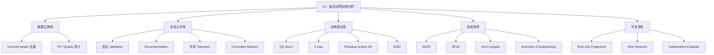

# ForgeLM V2 改进说明：从“能运行”到“能做公平实验”

这份文档专门解释 ForgeLM V2 为什么要改、改了什么、每项改进解决什么问题，以及怎样验证改进是否真的有效。

如果你还不知道如何安装、训练、评估和使用模型，请先阅读 [个人使用与训练说明](./个人使用与训练说明.md)。

## 一、V1 和 V2 分别解决什么问题？

### V1 的目标

V1 主要回答：

> 能不能从一份文本开始，训练 tokenizer、训练 Transformer、保存 checkpoint，并生成文本？

答案是可以。V1 已经打通了：

```text
Raw text
  -> 数据清洗
  -> Byte-level BPE
  -> Transformer
  -> AdamW training
  -> Validation loss
  -> Checkpoint
  -> Generation
```

这对于课程项目非常重要，因为它证明了你理解基本训练闭环。

### V1 的不足

当我们想把项目变成简历项目或研究实验时，只“能运行”还不够。还需要回答：

- 中文数据会不会被错误删除？
- 不同过滤方法是不是用了同一份 validation？
- 模型效果变化来自数据，还是来自 tokenizer 改变？
- Checkpoint 恢复时，数据或 tokenizer 是否已经变化？
- 过滤器删除的到底是什么？
- 新架构是否真的更稳定？
- 系统优化是否保证数值结果一致？

V2 的目标就是让这些问题可以被检查和验证。

## 二、V2 总体框架



## 三、改进 1：修复多语言去重

### V1 的问题

V1 曾经使用类似下面的规则提取去重词单元：

```text
[a-z0-9]+
```

它只认识英文字母和数字。

例如：

```text
机器学习可以处理中文
天气预报说明明天有雨
```

两句话都可能被处理成：

```text
[]
```

如果再对空列表计算 hash，完全不同的中文文档可能被当成重复文档。这是一个真实正确性 bug。

### V2 怎样修复？

V2 根据 Unicode category 识别字母和数字，并把中日韩字符作为独立去重单元。

```text
机器学习
-> [机, 器, 学, 习]
```

同时使用明确的 NFKC normalization [1]。

### 它起什么作用？

- 不再把非拉丁文本压成空集合
- Exact dedup 不会误删所有中文文档
- MinHash/LSH 可以比较中文字符 n-grams
- 为后续多语言数据处理保留可能性

### 怎样验证？

测试会检查两篇不同中文文档产生非空且不同的 dedup units。

## 四、改进 2：固定 Validation

### 为什么 Validation 必须固定？

假设我们比较两种数据策略：

```text
实验 A：Raw data
实验 B：Deduplicated data
```

如果实验 A 和 B 的 validation 不相同：

```text
A 考数学试卷
B 考英语试卷
```

那么比较分数没有意义。

### V2 怎样做？

V2 支持：

```toml
[data]
input_path = "data/my_train.txt"
validation_path = "data/my_validation.txt"
test_path = "data/my_test.txt"
```

Validation 和 Test 在所有训练数据过滤步骤之外固定，并分别保存 SHA-256。Validation 用于调参和选择 checkpoint；Test 从开始实验时就切好，但在所有配置冻结前保持封存。

### 起什么作用？

- 所有实验使用完全相同的 validation 考试题
- PPL 才能够直接比较
- 数据过滤不会偷偷改变评估难度
- 最终 test PPL 不会因为反复调参而变得乐观

## 五、改进 3：Train–Validation Decontamination

### 什么是 Contamination？

如果训练集里出现 validation 原文或近重复内容，模型可能不是“学会泛化”，而是“见过答案”。

### V2 怎样处理？

1. 把训练文档和 validation 文档转换成 n-gram 集合。
2. 找到存在共同 n-gram 的候选文档。
3. 计算 Jaccard similarity。
4. 超过阈值的训练文档被删除。

训练集会同时针对 Validation 和 Test 做反污染。该思路参考 DCLM 和 LM Evaluation Harness 的 decontamination 流程 [3, 4]。

### 起什么作用？

- 减少验证集泄漏
- 让 loss/PPL 更可信
- 为未来接入 benchmark 做准备

## 六、改进 4：Model-based Quality Filtering

### 为什么规则不够？

简单规则能发现：

- 太短
- 字母比例太低
- 同一个词重复很多次

但是下面两篇文本都可能通过规则：

```text
高质量：完整介绍实验方法、结果和局限
低质量：登录、注册、广告、菜单、相关推荐和下载链接
```

它们长度和字母比例都可能正常。

### DCLM 的思路

DataComp-LM 使用模型学习哪些网页更像高质量参考数据，并通过固定训练预算验证过滤效果 [3]。

### ForgeLM 的简化版本

ForgeLM 使用 Logistic Regression。输入特征包括：

- 文档长度
- 字母、数字和标点比例
- Unique-word ratio
- 平均词长
- URL 和重复字符信号
- 3/4/5-character hashed n-grams

可以把 hashed n-gram 理解成：

> 不保存所有字符串本身，而是通过稳定 hash 把大量短字符串映射到固定长度的特征向量。

### 当前局限

附带数据只有：

```text
16 条正样本
16 条负样本
```

所以 100% seed validation accuracy 不能代表真实网页效果。

### 为什么仍然值得实现？

它打通了完整研究流程：

```text
标注质量数据
  -> 训练分类器
  -> 给训练语料打分
  -> 按阈值过滤
  -> 训练语言模型
  -> 比较固定 validation PPL
```

## 七、改进 5：Controlled Data Ablation

### 什么是 Ablation？

Ablation 是一次只改变一个因素，观察结果怎样变化。

ForgeLM 比较：

| Variant | 处理方法 |
|---|---|
| Raw | 基础隐私处理和反污染 |
| Heuristic | Raw + 透明质量规则 |
| Dedup | Heuristic + Exact/MinHash 去重 |
| Model Quality | Dedup + 训练出的质量分类器 |

### 为了公平，哪些东西保持不变？

- Validation 文件和 hash
- Test 文件和 hash 保持固定并封存，ablation 不读取 test 指标
- BPE tokenizer 和 hash
- 模型配置
- 初始化 seed
- Batch size
- Sequence length
- Training steps
- Evaluation 方法

### Smoke 结果

| Variant | Train docs | PPL | 相对 Raw |
|---|---:|---:|---:|
| Raw | 40 | 93.34 | Baseline |
| Heuristic | 40 | 93.34 | 没有样本触发规则 |
| Dedup | 38 | 84.80 | 降低 9.1% |
| Model Quality | 33 | 97.14 | 上升 4.1% |

### 为什么 Model Quality 反而更差？

可能原因：

- 质量分类器训练样本太少
- 阈值 0.5 不适合真实训练分布
- 删除了对 validation 有帮助的文本
- 小数据下，减少数据量的损失大于质量提升

这是一项负结果，但它说明 ablation 框架能发现问题，而不是默认“新方法一定更好”。

详细报告见 [ablation_summary.json](./reports/v2/ablation_summary.json)。

## 八、改进 6：严格 Fingerprint 与 Resume

### V1 的风险

假设旧 tokenizer 和新 tokenizer 都有 8192 个 token：

```text
旧 tokenizer：ID 1000 = "ing"
新 tokenizer：ID 1000 = "the"
```

Embedding shape 完全一样，PyTorch 可以加载 checkpoint，但语义已经错了。

### V2 保存什么？

- Train JSONL SHA-256
- Validation JSONL SHA-256
- Dataset manifest SHA-256
- Tokenizer SHA-256
- Quality model SHA-256
- Model config
- Training config
- Seed
- Source code SHA-256

### 起什么作用？

Resume 时 fingerprint 不一致会报错，防止静默损坏实验。

这不是某篇大模型论文的新算法，而是数据版本管理和 ML reproducibility 的工程实践。TorchTitan 等现代训练系统也会保存模型、优化器、scheduler、dataloader 和训练状态 [16]。

## 九、改进 7：QK-Norm

### 先理解 Attention Logits

Attention 会计算：

```text
scores = QK^T / sqrt(d)
probabilities = softmax(scores)
```

如果 Q/K 数值越来越大，scores 会变得非常极端：

```text
[0.001, 0.002, 1000]
-> softmax 几乎全部给最后一个位置
```

这可能导致 softmax 过早饱和。

### QK-Norm 做什么？

在计算点积前归一化 Query 和 Key：

```text
Q = RMSNorm(Q)
K = RMSNorm(K)
```

原始 QK-Norm 工作见 [10]，现代大模型使用方式参考 OLMo 2 [11]。

### 预期作用

- 控制 attention logits 尺度
- 减少训练 loss spike
- 提高较深模型训练稳定性

对 8-layer 小模型，收益必须通过 ablation 验证，不能因为大模型使用就默认一定提升。

## 十、改进 8：Z-loss

### 问题是什么？

Cross-entropy 关心正确 token 和错误 token 的相对差异，但不一定阻止所有 logits 整体变大。

### Z-loss 做什么？

```text
z_loss = λ × mean(logsumexp(logits)^2)
```

它给过大的 logit partition function 一个很小的惩罚。ForgeLM 参考 OLMo 2 的训练稳定性配方 [11]。

### 一个重要细节

```text
训练 objective = cross_entropy + z_loss
PPL = exp(cross_entropy)
```

Perplexity 不能包含 z-loss。V2 增加了专门测试，避免混淆训练正则和语言模型概率指标。

## 十一、改进 9：Residual-scaled Initialization

每个 Transformer block 会向 residual stream 写入两次：

- Attention output
- Feed-forward output

层数越多，多个 residual contribution 的方差会累积。

V2 对这两个输出投影使用：

```text
std = 0.02 / sqrt(2 × n_layers)
```

它参考 GPT-2 的 depth-aware initialization [12]。

预期作用是让深层模型初始化时的 residual stream 尺度更稳定。

## 十二、改进 10：WSD 学习率

### Cosine

```text
Warmup -> 一直缓慢下降
```

它需要提前知道训练总步数。

### WSD

```text
Warmup -> Stable -> Decay
```

- Warmup：避免训练刚开始更新太激进
- Stable：主要学习阶段保持学习率
- Decay：训练结束前降低学习率，进行 cooldown

WSD 参考 MiniCPM [14]，PyTorch TorchTitan 也支持这一调度形式 [16]。

### 为什么适合 Scaling 实验？

可以从同一 stable checkpoint 分叉：

```text
Stable checkpoint
  -> 现在 cooldown
  -> 再训练更多数据后 cooldown
```

不用为每种训练长度从头再训一遍。

## 十三、改进 11：BF16

FP32 每个数约占 4 bytes，BF16 每个数约占 2 bytes。

BF16 的主要作用：

- 减少 activation memory
- 减少内存带宽
- 使用 Tensor Cores 加速矩阵乘法

RTX 3070 Ti 属于 Ampere Compute Capability 8.6，CUDA 文档中 8.x Tensor Cores 支持 BF16 [18, 19]。

ForgeLM 使用 autocast：

- 适合 BF16 的算子使用 BF16
- 某些敏感计算仍使用 FP32
- 参数和 optimizer state 由 PyTorch 管理

## 十四、改进 12：Activation Checkpointing

假设网络有很多层。

普通训练：

```text
Forward 保存所有中间结果
Backward 直接读取
```

Activation Checkpointing：

```text
Forward 只保存部分层输入
Backward 重新计算其他中间结果
```

因此：

```text
显存降低
训练时间增加
```

该方法的经典来源见 [15]。

对 8GB RTX 3070 Ti，这个交换通常很有价值。

## 十五、改进 13：torch.compile 与系统 Benchmark

`torch.compile` 会尝试：

- 捕获 PyTorch graph
- 融合多个操作
- 减少 Python overhead
- 为特定 shape 生成优化 kernel

但是它不是“打开就一定加速”。

项目实测：

| 实验 | 结果 |
|---|---:|
| Tiny CPU Eager Attention | 75,773 tokens/s |
| Tiny CPU SDPA | 95,077 tokens/s，约 1.25x |
| Tiny CPU compiled BF16 | 只有 baseline 的约 0.36x |

为什么 compiled BF16 CPU 更慢？

- 模型太小
- CPU BF16 kernel 特性不同
- 编译和数据转换开销占比大
- GPU 优化经验不能直接套到 CPU

所以系统实验必须报告：

- 硬件
- 模型 shape
- Batch/sequence length
- Precision
- Warmup/iterations
- 数值误差
- Tokens/s 和显存

报告见：

- [system_benchmark.json](./reports/v2/system_benchmark.json)
- [compiled_cpu_benchmark.json](./reports/v2/compiled_cpu_benchmark.json)

## 十六、改进 14：独立 Evaluate 与 Chat 入口

V1 只在训练循环中定期评估。V2 增加：

```bash
forgelm evaluate --config configs/rtx3070ti_v2.toml
```

这样训练完成后可以独立加载 checkpoint，验证 inference preprocessing、tokenizer 和 validation loss/PPL。

V2 还增加：

```bash
forgelm chat --config configs/rtx3070ti_v2.toml
```

它会维护对话历史，并把文本格式化成 `User/Assistant` prompt。但这是基础模型 completion，不等价于 SFT 后的聊天助手。

## 十七、RTX 3070 Ti 专用配置

[rtx3070ti_v2.toml](./configs/rtx3070ti_v2.toml) 使用：

- TinyStories 5M-character subset：5,810/323/323 个 Train/Validation/Test stories
- 约 26.75M 参数
- 8 layers
- Hidden size 512
- Sequence length 512
- Micro-batch 2
- Gradient accumulation 16
- BF16
- SDPA
- Activation Checkpointing
- `torch.compile`
- 1,000 steps
- 约 16.38M sampled tokens

预计训练时间约 1–3 小时，显存预计 3–7GB。具体估算与 OOM 调整顺序见主 README。

## 十八、V2 当前验证状态

- 24/24 unit tests 通过
- Unicode CJK regression 通过
- External validation consistency 通过
- Quality classifier training/serialization 通过
- Controlled ablation shared hashes 通过
- QK-Norm/Z-loss forward/backward 通过
- WSD schedule phases 通过
- Activation checkpoint backward 通过
- BF16 CPU training path 通过
- Python 3.13 + PyTorch 2.13 compile path 通过
- Fingerprint mismatch rejection 通过
- Independent checkpoint evaluation 通过
- Chat prompt/history/generation path 通过
- Deterministic TinyStories 90/5/5 split 与 cross-split exact-overlap 检查通过
- 独立 held-out test command 通过

## 十九、哪些还没有完成？

下面内容不能写成已经完成的成果：

- 真实大型语料的正式训练结果
- 3070 Ti 实测显存和训练时间
- 多随机种子正式 ablation
- 下游 benchmark
- 真正的 instruction SFT
- LoRA/QLoRA
- DPO/RLHF
- FSDP2/多 GPU
- FP8
- Web-scale external-memory deduplication

## 二十、参考文献

1. Unicode Consortium. [Unicode Normalization Forms](https://unicode.org/reports/tr15/).
2. Leskovec, Rajaraman, and Ullman. [Mining of Massive Datasets, Chapter 3](http://infolab.stanford.edu/~ullman/mmds/ch3.pdf).
3. Li et al., 2024. [DataComp-LM](https://arxiv.org/abs/2406.11794).
4. EleutherAI. [LM Evaluation Harness Decontamination](https://github.com/EleutherAI/lm-evaluation-harness/blob/main/docs/decontamination.md).
5. Sennrich, Haddow, and Birch, 2016. [Neural Machine Translation of Rare Words with Subword Units](https://aclanthology.org/P16-1162/).
6. Vaswani et al., 2017. [Attention Is All You Need](https://arxiv.org/abs/1706.03762).
7. Zhang and Sennrich, 2019. [Root Mean Square Layer Normalization](https://arxiv.org/abs/1910.07467).
8. Shazeer, 2020. [GLU Variants Improve Transformer](https://arxiv.org/abs/2002.05202).
9. Su et al., 2021. [RoFormer](https://arxiv.org/abs/2104.09864).
10. Henry et al., 2020. [Query-Key Normalization for Transformers](https://arxiv.org/abs/2010.04245).
11. Team OLMo et al., 2025. [2 OLMo 2 Furious](https://arxiv.org/abs/2501.00656).
12. Radford et al., 2019. [GPT-2 Technical Report](https://cdn.openai.com/better-language-models/language_models_are_unsupervised_multitask_learners.pdf).
13. Loshchilov and Hutter, 2019. [Decoupled Weight Decay Regularization](https://arxiv.org/abs/1711.05101).
14. Hu et al., 2024. [MiniCPM](https://arxiv.org/abs/2404.06395).
15. Chen et al., 2016. [Training Deep Nets with Sublinear Memory Cost](https://arxiv.org/abs/1604.06174).
16. PyTorch Team. [TorchTitan](https://github.com/pytorch/torchtitan).
17. Hoffmann et al., 2022. [Training Compute-Optimal Large Language Models](https://arxiv.org/abs/2203.15556).
18. NVIDIA. [GeForce RTX 3070 Ti Specifications](https://www.nvidia.com/en-au/geforce/graphics-cards/30-series/rtx-3070-3070ti/).
19. NVIDIA CUDA Programming Guide. [Compute Capability Feature Support](https://docs.nvidia.com/cuda/cuda-programming-guide/05-appendices/compute-capabilities.html).
20. Eldan and Li, 2023. [TinyStories: How Small Can Language Models Be and Still Speak Coherent English?](https://arxiv.org/abs/2305.07759).
