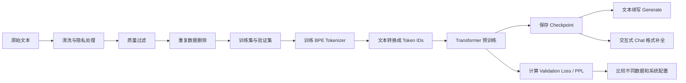

# ForgeLM：从原始文本训练一个小型语言模型

这份 README 面向刚开始接触大模型的同学。它会先告诉你整个项目在做什么，然后解释每个模块为什么存在，最后给出从 GitHub 下载、在 GPU 电脑上训练、验证效果和使用模型的完整命令。

如果你想了解 V2 相比最初版本具体改进了什么，请继续阅读 [V2 改进原理说明](./V2改进原理说明.md)。

## 一、开始之前必须知道的三件事

### 1. ForgeLM 训练的是什么模型？

ForgeLM 训练的是一个 **Decoder-only Transformer 基础语言模型**。

它的任务非常简单：

> 给定前面的 token，预测下一个 token。

例如训练文本是：

```text
The sky is blue.
```

模型会学习：

```text
The -> sky
The sky -> is
The sky is -> blue
```

当这种训练在大量文本上重复很多次后，模型会逐渐学会语言结构、常见知识和文本风格。

### 2. 训练完成后可以聊天吗？

需要区分两种能力。

第一种是 **文本续写**：

```text
输入：Once upon a time
输出：...模型继续往后写...
```

ForgeLM 当前完整支持这种能力。

第二种是 **指令对话**：

```text
用户：请解释什么是梯度下降。
助手：梯度下降是一种……
```

真正可靠的指令对话通常需要：

1. 先预训练基础模型。
2. 再使用“问题—回答”数据做 Supervised Fine-Tuning（SFT）。
3. 有时还会继续做 DPO、RLHF 或其他偏好优化。

ForgeLM 目前完成的是第一步。项目提供 `forgelm chat` 命令，让基础模型按照 `User/Assistant` 格式进行交互式补全，但它 **没有经过指令微调**，因此不能期待它像 ChatGPT 一样稳定回答问题。

另外，3070 Ti 上推荐训练的 ForgeLM 模型大约只有 3000 万参数；ChatGPT 等模型的训练规模远大于这个项目。这个项目的主要价值是理解和展示完整的大模型训练流程，而不是在个人显卡上复刻商业聊天模型。

### 3. MacBook 没有 NVIDIA GPU 怎么办？

完全可以采用下面的工作流：

```text
MacBook
  -> 写代码、阅读代码、跑 24 个单元测试、运行 CPU smoke test
  -> 上传源码到 GitHub

GitHub
  -> 保存源码、配置、README 和轻量实验报告

带 RTX 3070 Ti 的台式机
  -> git clone
  -> 安装 CUDA 版 PyTorch
  -> 运行正式训练、评估和生成
```

模型 checkpoint、真实训练数据和 `artifacts/` 默认不会上传 GitHub，因为它们可能很大，也可能包含隐私数据。

## 二、项目的完整框架



可以把它理解成一条工厂流水线：

1. 数据模块决定“给模型看什么书”。
2. Tokenizer 决定“模型怎样把文字切成编号”。
3. Transformer 是“真正学习规律的大脑”。
4. 训练循环负责“出题、算错多少、改参数”。
5. Validation 负责“用没见过的题检查学习效果”。
6. Checkpoint 负责“保存学习进度”。
7. Generate/Chat 负责“使用训练后的模型”。

下面逐个解释。

## 三、模块 1：数据处理

### 为什么不能把网页文本直接拿来训练？

原始网页数据可能包含：

- 菜单、广告、登录页面和 Cookie 提示
- 重复网页和模板内容
- Email、电话号码和 IP 地址
- 乱码、空字符和异常 Unicode
- 和验证集完全相同的内容
- 很短、没有语义或大量重复的文本

如果不处理，模型会把大量计算浪费在垃圾内容上，还可能记忆个人信息或让验证结果虚高。

### ForgeLM 做了哪些处理？

#### Unicode 标准化

计算机中的两个字符看起来可能相同，但底层编码不同。ForgeLM 使用 NFKC normalization，把兼容形式转换为稳定形式，减少无意义差异 [1]。

#### PII Masking

PII 是 Personally Identifiable Information，即个人身份相关信息。

ForgeLM 会把：

```text
name@example.com -> |||EMAIL_ADDRESS|||
555-010-2020     -> |||PHONE_NUMBER|||
192.168.1.10     -> |||IP_ADDRESS|||
```

这样可以保留句子结构，同时删除具体值。

#### 质量规则

项目会检查：

- 文档是否过短
- 字母字符比例是否过低
- 是否由同一个词大量重复组成

这些规则便宜、透明，但能力有限。

#### Model-based Quality Filtering

ForgeLM 还训练了一个小型文本质量分类器。它学习区分：

```text
高质量：有完整解释、例子、测量和上下文的文本
低质量：广告、导航、重复词、下载诱导和模板页面
```

当前分类器是 hashed character n-gram Logistic Regression。它不是大型神经网络，而是一个容易理解和离线运行的基线。这个思路参考了 DataComp-LM 的 model-based filtering 工作 [3]。

#### Exact Deduplication

如果两篇标准化后的文档完全相同，只保留一篇。

#### MinHash / LSH Near Deduplication

两篇文档可能只改了年份或一个词，不能靠完全相同的 hash 发现。

ForgeLM 会：

1. 把文档变成连续词组集合。
2. 使用 MinHash 构造短签名。
3. 使用 LSH 找出可能相似的文档。
4. 对候选文档计算真实 Jaccard similarity。
5. 超过阈值时只保留一篇。

MinHash/LSH 的经典介绍见参考文献 [2]。

#### 固定 Validation 与 Decontamination

Validation set 是模型训练时不参与参数更新的数据，作用类似考试题。

如果训练数据里已经出现了考试原题，考试成绩就没有意义。因此 ForgeLM：

- 支持使用单独的 validation 文件
- 不允许数据过滤方法改变 validation 内容
- 删除和 validation 高度重叠的训练文档
- 保存 validation SHA-256，保证不同实验使用同一份考试题

## 四、模块 2：Tokenizer

Transformer 不能直接处理字符串，只能处理整数。

Tokenizer 的作用是：

```text
"The cat sleeps"
    -> [341, 92, 1840]
```

ForgeLM 使用 Byte-level BPE。

### 为什么从 byte 开始？

UTF-8 文本最终都能表示成 0–255 的 bytes，因此只要保留 256 个基础 byte token，任何语言都不会出现完全无法编码的字符。

### BPE 做什么？

BPE 会反复寻找最常出现的相邻 token：

```text
t + h -> th
th + e -> the
```

这样常见字符串可以用更少 token 表示。BPE 在 NLP 中的经典来源见 Sennrich 等人的工作 [5]。

ForgeLM 还定义了：

- PAD：批处理时补齐长度
- EOS：表示一篇文档结束

## 五、模块 3：Transformer 模型

ForgeLM 使用 Decoder-only Transformer [6]。

模型的数据流大致是：

```text
Token IDs
  -> Embedding
  -> 多个 Transformer Block
  -> 输出每个位置的下一个 token 概率
```

### Embedding

Token ID 只是编号，本身没有语义。Embedding 把每个编号转换成一个向量，模型在训练中学习这些向量。

### Causal Self-Attention

Attention 让每个位置查看前面的 token，并判断哪些内容重要。

“Causal” 表示不能偷看未来。例如预测第 5 个 token 时，只能使用第 1–4 个 token。

ForgeLM 同时保留：

- Eager Attention：步骤清楚，便于学习和调试
- PyTorch SDPA：PyTorch 优化后的 attention 路径

### RoPE

Attention 本身不知道词序。RoPE 通过旋转 Query/Key 向量加入位置信息，让模型区分“猫追狗”和“狗追猫” [9]。

### RMSNorm

RMSNorm 控制每层输入的数值尺度，减少训练不稳定，同时比完整 LayerNorm 更简单 [7]。

### SwiGLU

SwiGLU 是 Transformer 中 Feed-Forward Network 的门控激活形式。可以把它理解为：一条分支产生内容，另一条分支决定有多少内容通过 [8]。

### QK-Norm

Query 和 Key 太大时，attention softmax 容易变得极端。QK-Norm 在计算 attention 前归一化 Query/Key，帮助控制 attention logits [10, 11]。

### Z-loss

Z-loss 是训练 loss 中很小的正则项，用来限制 logits 整体无限增大。它只用于训练稳定性，计算 Perplexity 时不会混进去 [11]。

## 六、模块 4：模型怎样训练

训练过程不断重复下面四步：

```text
1. 从 token stream 抽取一批连续 token
2. 模型预测下一个 token
3. Cross-Entropy 衡量预测错误程度
4. Optimizer 根据梯度修改模型参数
```

### Cross-Entropy Loss

如果正确 token 的预测概率很高，loss 较低；如果模型把概率分配给错误 token，loss 较高。

所以训练通常希望：

```text
Train loss 逐渐下降
Validation loss 也逐渐下降
```

### AdamW

AdamW 是 ForgeLM 使用的优化器。它根据每个参数历史梯度调整更新幅度，并把 weight decay 与梯度更新分开 [13]。

### Gradient Accumulation

8GB 显存无法放入很大的 batch。Gradient accumulation 会：

```text
跑多个小 batch 的 backward
  -> 累积梯度
  -> 最后统一 optimizer.step()
```

这样可以用较小显存模拟更大的有效 batch。

### Gradient Clipping

当梯度突然非常大时，训练可能崩溃。Gradient clipping 会限制全局梯度范数。

### WSD 学习率

WSD 是 Warmup-Stable-Decay [14]：

```text
Warmup：学习率从小到大
Stable：保持稳定学习率
Decay：训练结束前逐渐降低
```

### BF16

BF16 使用更少显存和内存带宽。RTX 3070 Ti 属于 Ampere、Compute Capability 8.6，CUDA 文档列出的 8.x Tensor Cores 支持 BF16 [18, 19]。

### Activation Checkpointing

普通训练会保存大量中间激活。Activation Checkpointing 只保存部分结果，backward 时重新计算其他部分：

```text
更少显存 <-> 更多计算时间
```

经典方法见参考文献 [15]。

### torch.compile

`torch.compile` 会尝试把 PyTorch eager graph 编译和融合，减少 Python overhead、生成优化 kernel。第一次训练会有编译等待时间，而且不是任何硬件和 tensor shape 都会加速 [16]。

## 七、MacBook、GitHub 和台式机工作流

当前 `forgelm/` 目录还不是独立 Git repository。你可以在 MacBook 上执行：

```bash
cd "/你的本地项目路径/forgelm"
git init
git branch -M main
git add .
git status
git commit -m "Initial ForgeLM V2 project"
```

然后在 GitHub 新建一个 **空仓库**，不要让 GitHub 自动添加 README。再执行：

```bash
git remote add origin https://github.com/你的用户名/forgelm.git
git push -u origin main
```

GitHub 官方也提供了 [上传现有本地仓库的说明](https://docs.github.com/en/migrations/importing-source-code/using-the-command-line-to-import-source-code/adding-locally-hosted-code-to-github)。

### 哪些文件不会上传？

`.gitignore` 已经排除了：

```text
artifacts/
*.pt
*.bin
.venv/
__pycache__/
```

因此通常不会上传：

- Checkpoint
- 大型 token binary
- 训练产生的临时 artifacts
- Python 虚拟环境

提交前一定先看：

```bash
git status
```

不要把密码、API key、私人数据或有版权限制的数据上传到公开仓库。大型模型如果确实需要共享，可考虑 Git LFS 或模型托管平台；GitHub LFS 的存储和流量存在额度限制。[GitHub LFS 文档](https://docs.github.com/en/repositories/working-with-files/managing-large-files/about-git-large-file-storage)

### 台式机下载

在台式机上：

```bash
git clone https://github.com/你的用户名/forgelm.git
cd forgelm
```

## 八、在 RTX 3070 Ti 上安装环境

RTX 3070 Ti 官方规格包括 6144 CUDA cores、8GB GDDR6X 和第三代 Tensor Cores [18]。

推荐 Python 3.12 或 3.13。

### Windows PowerShell

```powershell
py -3.12 -m venv .venv
.venv\Scripts\Activate.ps1
python -m pip install --upgrade pip
```

### Linux

```bash
python3.12 -m venv .venv
source .venv/bin/activate
python -m pip install --upgrade pip
```

然后前往 [PyTorch 官方安装选择器](https://docs.pytorch.org/get-started/locally/)，根据你的操作系统和驱动选择 CUDA wheel。不要直接复制 Mac 的 CPU/MPS PyTorch 环境。

安装完 CUDA 版 PyTorch 后，再安装 ForgeLM：

```bash
python -m pip install -e .
```

验证 GPU：

```bash
nvidia-smi
python -c "import torch; print(torch.__version__); print(torch.cuda.is_available()); print(torch.cuda.get_device_name(0)); print(torch.cuda.is_bf16_supported())"
```

期望看到：

```text
True
NVIDIA GeForce RTX 3070 Ti
True
```

如果 `torch.cuda.is_available()` 是 `False`，先解决驱动/PyTorch CUDA 安装问题，不要开始训练。

## 九、第一次运行：先不要直接训练几小时

### 第一步：运行单元测试

```bash
python -m unittest discover -s tests -v
```

当前应该是 24/24 tests 通过。

### 第二步：运行小型 Smoke Test

```bash
forgelm run --config configs/smoke_v2.toml
```

Smoke test 的作用是验证：

- 数据路径正确
- Tokenizer 能训练
- 模型 forward/backward 正常
- Checkpoint 能保存
- Evaluation 和 generation 能运行

Smoke 模型只有约 11.5 万参数，生成乱码或不流畅文本是正常的。它不是正式效果实验。

### 第三步：检查 3070 Ti 配置

```bash
forgelm doctor --config configs/rtx3070ti_v2.toml
```

专用配置位于 [configs/rtx3070ti_v2.toml](./configs/rtx3070ti_v2.toml)。

## 十、已经准备好的 Train / Validation / Test 数据

仓库里的 `sample_corpus.txt` 仍然只用于 smoke test。针对 RTX 3070 Ti 正式实验，项目现在额外准备了 TinyStories 5M-character subset。TinyStories 是由简单英文儿童故事组成的公开合成数据集，原论文专门用于研究小模型能否生成连贯语言 [21]。

数据位于：

```text
data/tinystories_5m/
├── train.txt
├── validation.txt
├── test.txt
├── manifest.json
└── DATASET_CARD.md
```

切分结果：

| Split | 文档数 | 字符数 | 词数 | 用途 |
|---|---:|---:|---:|---|
| Train | 5,810 | 4,630,053 | 925,079 | 训练 tokenizer 和模型参数 |
| Validation | 323 | 257,176 | 51,422 | 调参、选择 checkpoint |
| Test | 323 | 253,202 | 50,756 | 最终配置冻结后评估 |

切分脚本先根据 `<|endoftext|>` 识别完整故事，丢弃开头和结尾的不完整片段，在全体数据上删除 exact duplicates，然后使用固定 seed 按文档级切成 90%/5%/5%。三组 exact overlap 均为 0，所有文件都有 SHA-256，详见 [manifest.json](./data/tinystories_5m/manifest.json)。

复现切分：

```bash
PYTHONPATH=src python scripts/split_tinystories.py \
  --source ../assignment1-basics-main/tests/fixtures/tinystories_sample_5M.txt \
  --output-dir data/tinystories_5m \
  --seed 42
```

TinyStories 官方页面标注的许可为 CDLA-Sharing-1.0，来源和论文链接记录在 [DATASET_CARD.md](./data/tinystories_5m/DATASET_CARD.md)。

### 如果以后换成自己的数据

ForgeLM 读取“空行分隔文档”的 UTF-8 文本：

ForgeLM 当前读取“空行分隔文档”的 UTF-8 文本：

```text
第一篇文档第一行
第一篇文档第二行

第二篇文档

第三篇文档
```

建议同样准备三份：

```text
data/my_train.txt
data/my_validation.txt
data/my_test.txt
```

然后修改 `configs/rtx3070ti_v2.toml`：

```toml
[data]
input_path = "data/my_train.txt"
validation_path = "data/my_validation.txt"
test_path = "data/my_test.txt"
```

初次正式实验建议先使用几 MB 到几十 MB 文本。ForgeLM 的 BPE 是教学型纯 Python 实现，直接对超大语料训练 8192 vocabulary 会让 CPU preprocessing 成为瓶颈。

## 十一、开启 RTX 3070 Ti 正式训练

```bash
forgelm run --config configs/rtx3070ti_v2.toml
```

专用配置大致是：

| 项目 | 数值 |
|---|---:|
| 最大 vocabulary | 2,048 |
| 模型参数量 | 约 26.75M |
| Transformer layers | 8 |
| Hidden dimension | 512 |
| Attention heads | 8 |
| Context / training sequence | 1,024 / 512 |
| Micro-batch | 2 |
| Gradient accumulation | 16 |
| Effective tokens / step | 16,384 |
| Steps | 1,000 |
| Sampled training tokens | 约 16.38M |
| Precision | BF16 |
| Activation checkpointing | 开启 |

### 训练时会生成什么？

```text
artifacts/v2/rtx3070ti/
├── dataset/
│   ├── train.jsonl
│   ├── validation.jsonl
│   └── dataset_manifest.json
├── tokenizer.json
├── quality_model.json
├── run_fingerprint.json
├── metrics.jsonl
├── checkpoint_step_000250.pt
├── checkpoint_step_000500.pt
├── checkpoint_step_000750.pt
├── checkpoint_step_001000.pt
├── ...
├── checkpoint_last.pt
├── training_summary.json
├── pipeline_summary.json
└── sample.txt
```

### 如何观察训练？

Linux/macOS：

```bash
tail -f artifacts/v2/rtx3070ti/metrics.jsonl
```

Windows PowerShell：

```powershell
Get-Content artifacts/v2/rtx3070ti/metrics.jsonl -Wait
```

重点关注：

- `loss`：训练目标是否整体下降
- `gradient_norm`：是否出现非常大的异常值
- `tokens_per_second`：GPU 实际训练速度
- `peak_memory_bytes`：显存峰值
- Validation loss：是否下降后又开始上升

如果 loss 变成 `NaN` 或 CUDA OOM，应停止训练并调整配置。

## 十二、训练中断后怎样恢复？

例如从第 1000 步恢复：

```bash
forgelm run \
  --config configs/rtx3070ti_v2.toml \
  --resume artifacts/v2/rtx3070ti/checkpoint_step_001000.pt
```

Resume 要求数据、tokenizer、model config、training config 和源码 fingerprint 一致。

如果你修改了数据或代码，ForgeLM 拒绝恢复是正常保护行为。此时应该创建一个新的 output directory，作为新实验运行。

## 十三、训练完成后如何验证效果？

### 1. 运行独立 Evaluation

```bash
forgelm evaluate --config configs/rtx3070ti_v2.toml
```

它会读取：

- `checkpoint_last.pt`
- `tokenizer.json`
- 准备好的 `validation.jsonl`

并输出：

- Cross-entropy loss
- Perplexity
- Evaluation tokens/s
- 设备和精度信息

结果保存在：

```text
artifacts/v2/rtx3070ti/evaluation_summary.json
```

### 2. 怎样理解 Loss 和 Perplexity？

Perplexity 简写为 PPL：

```text
PPL = exp(cross_entropy_loss)
```

在完全相同的 validation 和 tokenizer 上：

```text
Loss 越低通常越好
PPL 越低通常越好
```

但不同 tokenizer、不同 validation 的 PPL 不能直接比较。

### 3. 最终 Test Set 评估

当学习率、训练步数、数据过滤方法、模型结构和最佳 checkpoint 全部确定后，才运行：

```bash
forgelm test --config configs/rtx3070ti_v2.toml
```

结果写入：

```text
artifacts/v2/rtx3070ti/test_summary.json
```

`evaluate` 可以在开发期间反复运行；`test` 应视为最终封存评估，不能根据 test PPL 继续调参。ForgeLM 会在运行 test 时打印提醒。

### 4. 检查生成样例

```bash
forgelm generate \
  --checkpoint artifacts/v2/rtx3070ti/checkpoint_last.pt \
  --tokenizer artifacts/v2/rtx3070ti/tokenizer.json \
  --prompt "Once upon a time" \
  --device cuda \
  --max-new-tokens 160
```

观察：

- 是否开始形成完整单词和句子
- 是否一直重复同一句话
- 是否能延续 prompt 的语言和主题
- 是否很快输出 EOS

### 5. 运行 Data Ablation

```bash
forgelm ablate-data --config configs/rtx3070ti_v2.toml
```

它会比较 Raw、Heuristic、Dedup、Model Quality 四种数据版本。不过 3070 Ti 正式 ablation 会执行四次训练，时间接近单次训练的四倍。建议先把 `steps` 改成 300–500 做预实验，再决定是否运行完整版本。

## 十四、如何使用交互式 Chat？

```bash
forgelm chat --config configs/rtx3070ti_v2.toml
```

交互界面：

```text
你：hello
模型：...

你：/reset
历史已清空。

你：/quit
```

这个命令会把历史格式化为：

```text
User: hello
Assistant: ...
User: another question
Assistant:
```

但请再次注意：**这只是基础模型的对话格式补全，不是真正指令微调后的聊天模型。**

如果你的最终目标是做一个实用聊天助手，更现实的路线是：

1. 用 ForgeLM 学习并展示从零预训练流程。
2. 另外选择一个已有的 1B–3B 开源基础模型。
3. 在 3070 Ti 上使用 LoRA/QLoRA 做指令微调。
4. 把这部分作为 ForgeLM 后续的 Post-training 模块。

## 十五、RTX 3070 Ti 8GB 能不能训练？

结论：**可以训练推荐的 ForgeLM 3070 Ti 配置，但不能训练商业级大模型。**

RTX 3070 Ti 官方规格为 8GB GDDR6X、6144 CUDA cores、Ampere 第三代 Tensor Cores [18]。CUDA Compute Capability 8.x 支持 BF16 Tensor Core 输入 [19]。

### 推荐配置为什么可能装得下？

约 26.75M 参数在 AdamW FP32 参数/梯度/状态下，理论持久训练状态下限约为：

```text
参数 + 梯度 + Adam 一阶矩 + Adam 二阶矩
≈ 26.75M × 16 bytes
≈ 0.43 GB
```

实际显存还包括：

- Activations
- Logits
- CUDA kernels/workspace
- PyTorch allocator cache
- `torch.compile` 生成的 workspace

使用 BF16、micro-batch 2、SDPA 和 Activation Checkpointing 后，预计实际峰值约 **3–7GB**，因此有机会放入 8GB。这个范围是分析估计，最终要以 `peak_memory_bytes` 和 `nvidia-smi` 为准。

如果出现 OOM，按顺序调整：

1. `batch_size = 2` 改为 `1`
2. `seq_len = 512` 改为 `384` 或 `256`
3. 保持或增加 `gradient_accumulation_steps`
4. 确认 `activation_checkpointing = true`
5. 关闭浏览器、游戏和其他占用 GPU 的程序
6. 如果 compile 期间 OOM，先设 `compile_model = false`

### 预计训练多久？

推荐配置：

```text
Non-embedding 参数约 25.7M
Sampled tokens 约 16.38M
近似训练 FLOPs = 6 × N × D ≈ 2.53 × 10^15
```

结合 3070 Ti 8GB、small-model GPU utilization、Activation Checkpointing、evaluation 和 checkpoint overhead，保守预计：

| 阶段 | 预计时间 |
|---|---:|
| 环境安装 | 10–30 分钟 |
| 首次 torch.compile | 2–10 分钟 |
| Sample 数据的 preprocessing | 数秒到数分钟 |
| 几 MB–几十 MB语料的 BPE preprocessing | 数分钟到数小时，取决于语料与 vocab |
| 1,000-step 正式训练 | 约 1–3 小时 |
| 独立 evaluation | 数分钟以内 |
| 四组完整 ablation | 约单次训练的 4 倍 |

造成时间差异的因素包括：

- Windows 还是 Linux
- PyTorch/CUDA 版本
- GPU 是否同时驱动显示器
- 散热和功耗限制
- `torch.compile` 是否成功优化
- 实际 tokens/s
- 数据预处理速度

最准确的方法是先训练 100 步：

```toml
steps = 100
warmup_steps = 10
wsd_decay_steps = 10
checkpoint_interval = 50
```

记录平均 `tokens_per_second`，再估算：

```text
预计训练秒数 ≈ 16,384,000 / 实际 tokens_per_second
```

最后再乘 `1.2–1.5`，为 evaluation、checkpoint 和波动留余量。

### 原来的 gpu_v2.toml 呢？

原 [gpu_v2.toml](./configs/gpu_v2.toml) 约 91M 参数，并计划训练约 13.1 亿 sampled tokens。它对 8GB 显存和个人训练时间都过于激进：

- 可能 OOM
- 即使能运行也可能需要十几到数十小时
- Sample corpus 会被重复采样过多，结果没有意义

3070 Ti 应优先使用 [rtx3070ti_v2.toml](./configs/rtx3070ti_v2.toml)。

## 十六、常见问题

### CUDA Out of Memory

降低 micro-batch 或 sequence length，不要先降低 gradient accumulation，否则有效 batch 也会变小。

### torch.compile 报错

先设置：

```toml
compile_model = false
```

确认 eager/SDPA 训练能运行后，再单独调试 compile。

### BF16 不支持

运行：

```bash
python -c "import torch; print(torch.cuda.is_bf16_supported())"
```

如果返回 `False`，当前 ForgeLM 可以改为 FP32，但会更慢并增加显存；之后可以再扩展 FP16 + GradScaler 路径。

### 生成结果还是乱码

可能原因：

- 数据太少
- 训练 token 太少
- Vocabulary 对小语料过大
- 学习率不合适
- 数据质量差
- 模型只有约 30M 参数

先看 validation loss 是否明显下降，再判断生成。

### Validation loss 先降后升

可能发生过拟合。可以减少 steps、增加数据，或保留 validation 最优 checkpoint，而不是只使用最后一步。

## 十七、项目目录

```text
forgelm/
├── configs/
│   ├── smoke_v2.toml
│   ├── rtx3070ti_v2.toml
│   └── gpu_v2.toml
├── data/
├── reports/v2/
├── src/forgelm/
│   ├── data_pipeline.py
│   ├── quality_model.py
│   ├── tokenizer.py
│   ├── model.py
│   ├── training.py
│   ├── evaluation.py
│   ├── chat.py
│   ├── fingerprint.py
│   ├── benchmark.py
│   ├── scaling.py
│   ├── pipeline.py
│   └── cli.py
├── tests/
├── README.md                    # 面向公开读者的专业项目主页
├── 个人使用与训练说明.md          # 零基础操作手册
└── V2改进原理说明.md             # V1 到 V2 的通俗原理说明
```

## 十八、参考文献

1. Unicode Consortium. [Unicode Normalization Forms](https://unicode.org/reports/tr15/).
2. Leskovec, Rajaraman, and Ullman. [Mining of Massive Datasets, Chapter 3](http://infolab.stanford.edu/~ullman/mmds/ch3.pdf). MinHash/LSH。
3. Li et al., 2024. [DataComp-LM](https://arxiv.org/abs/2406.11794). Model-based filtering 与数据实验。
4. EleutherAI. [LM Evaluation Harness Decontamination](https://github.com/EleutherAI/lm-evaluation-harness/blob/main/docs/decontamination.md).
5. Sennrich, Haddow, and Birch, 2016. [Neural Machine Translation of Rare Words with Subword Units](https://aclanthology.org/P16-1162/). BPE。
6. Vaswani et al., 2017. [Attention Is All You Need](https://arxiv.org/abs/1706.03762). Transformer。
7. Zhang and Sennrich, 2019. [Root Mean Square Layer Normalization](https://arxiv.org/abs/1910.07467). RMSNorm。
8. Shazeer, 2020. [GLU Variants Improve Transformer](https://arxiv.org/abs/2002.05202). SwiGLU。
9. Su et al., 2021. [RoFormer](https://arxiv.org/abs/2104.09864). RoPE。
10. Henry et al., 2020. [Query-Key Normalization for Transformers](https://arxiv.org/abs/2010.04245). QK-Norm。
11. Team OLMo et al., 2025. [2 OLMo 2 Furious](https://arxiv.org/abs/2501.00656). QK-Norm、Z-loss、RoPE theta。
12. Radford et al., 2019. [GPT-2 Technical Report](https://cdn.openai.com/better-language-models/language_models_are_unsupervised_multitask_learners.pdf).
13. Loshchilov and Hutter, 2019. [Decoupled Weight Decay Regularization](https://arxiv.org/abs/1711.05101). AdamW。
14. Hu et al., 2024. [MiniCPM](https://arxiv.org/abs/2404.06395). WSD。
15. Chen et al., 2016. [Training Deep Nets with Sublinear Memory Cost](https://arxiv.org/abs/1604.06174). Activation Checkpointing。
16. PyTorch Team. [TorchTitan](https://github.com/pytorch/torchtitan). 现代 PyTorch 训练系统。
17. Hoffmann et al., 2022. [Training Compute-Optimal Large Language Models](https://arxiv.org/abs/2203.15556). Chinchilla Scaling Law。
18. NVIDIA. [GeForce RTX 3070 Ti Specifications](https://www.nvidia.com/en-au/geforce/graphics-cards/30-series/rtx-3070-3070ti/).
19. NVIDIA CUDA Programming Guide. [Compute Capability Feature Support](https://docs.nvidia.com/cuda/cuda-programming-guide/05-appendices/compute-capabilities.html).
20. PyTorch. [Start Locally](https://docs.pytorch.org/get-started/locally/).
21. Eldan and Li, 2023. [TinyStories: How Small Can Language Models Be and Still Speak Coherent English?](https://arxiv.org/abs/2305.07759).
